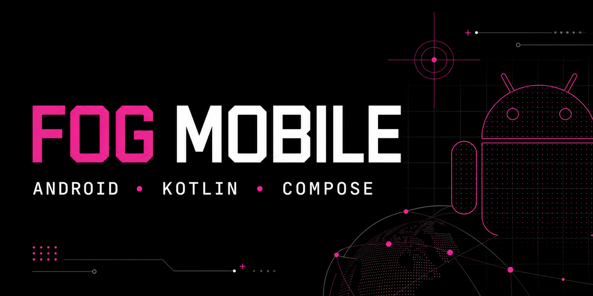
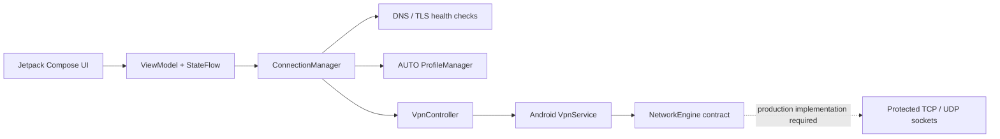

<div align="center">
  

  # FOG Mobile

  **Local-first Android network diagnostics and VpnService reference architecture built with Kotlin and Jetpack Compose.**

  [](https://developer.android.com/)
  [](https://kotlinlang.org/)
  [](https://developer.android.com/compose)
  [](https://developer.android.com/tools/releases/platforms)
  [](LICENSE)
  [](#privacy-and-security)
  [](https://github.com/DenisRapira/FOG-Mobile/actions/workflows/android-ci.yml)
</div>

FOG Mobile is an open-source Android application for Instagram and YouTube connectivity diagnostics. It demonstrates a privacy-focused `VpnService` boundary, per-app package allowlisting, real DNS and TLS health checks, bounded AUTO profile selection, Hilt dependency injection, DataStore preferences, and a Jetpack Compose Material 3 interface.

Inspired by the UI / Agent / Engine separation of [FOG Prime](https://github.com/DenisRapira/FOG-Prime), the Android implementation keeps network policy, diagnostics, service lifecycle, and UI state in explicit layers.

> [!IMPORTANT]
> The bundled `BaselineLocalNetworkEngine` does **not** include a userspace TCP/IP forwarding stack. It declares `canForwardPackets = false`, so `FogVpnService` refuses to establish TUN instead of blackholing Instagram or YouTube traffic. This repository is a tested Android network-diagnostics application and VpnService architecture foundation, not a working censorship-bypass release.

## Why FOG Mobile

- **Real connectivity checks:** DNS resolution and certificate-validated TLS handshakes for Instagram, YouTube, and media CDN endpoints.
- **Android VpnService architecture:** system VPN permission flow, foreground service lifecycle, TUN boundary, and explicit engine capability contract.
- **Per-app VPN targeting:** official package discovery for Instagram, YouTube, and YouTube Music.
- **Local-first privacy:** no remote VPN backend, MITM, custom CA, account, analytics, ads, or traffic-content logging.
- **Modern Android stack:** Kotlin, Jetpack Compose, Material 3, Hilt, Coroutines, StateFlow, Navigation Compose, and DataStore.
- **Production-oriented build:** API 36, JDK 17, R8 shrinking, signed APK/AAB, Android Lint, unit tests, and compiled instrumentation tests.
- **Honest status model:** the UI never reports a tunnel as running without an operational packet-forwarding engine.

## Architecture



| Layer | Responsibility |
| --- | --- |
| `ui` | Compose screens, navigation, diagnostics, theme, and user-visible state |
| `domain` | Connection policy and testable contracts |
| `data` | Health checks, profile selection, and DataStore preferences |
| `network` | Android connectivity observation |
| `vpn` | VpnService lifecycle, package allowlist, TUN and engine boundary |
| `core` | Immutable state, probe, profile, and network models |

See [architecture notes](docs/FOG_MOBILE_ARCHITECTURE.md) for the FOG Prime mapping and state machine.

## Features

- Onboarding with Android VPN permission handling
- Instagram DNS, TLS, and media CDN probes
- YouTube DNS, TLS, video CDN, and UDP/443 route probes
- Wi-Fi and mobile-network awareness
- Bounded profile selection with no infinite retry loop
- Dashboard, staged connection check, diagnostics, settings, and about screens
- Anonymized diagnostic export without URLs, cookies, payloads, or user content
- Adaptive, monochrome, and foreground-service notification icons
- Release signing through ignored local properties

## Quick Start

### Requirements

- JDK 17
- Android SDK Platform 36
- Android Build Tools 36.0.0
- Android Studio or the included Gradle Wrapper

### Build and test

```powershell
git clone https://github.com/DenisRapira/FOG-Mobile.git
cd FOG-Mobile
.\gradlew.bat testDebugUnitTest lintDebug assembleDebug
```

Release artifacts:

```powershell
.\gradlew.bat assembleRelease bundleRelease assembleDebugAndroidTest
```

Release signing is loaded from the ignored `keystore.properties`. Read [release signing](docs/RELEASE.md) before replacing or backing up the upload key.

## Verification

The current source was verified on Windows with Gradle 8.11.1, Android Gradle Plugin 8.10.1, JDK 17, and Android API 36.

| Check | Result |
| --- | --- |
| Kotlin / Compose / Hilt compilation | Passed |
| Unit tests | Passed |
| Android Lint | Passed |
| Debug APK | Built |
| Signed release APK | Built and verified with APK Signature Scheme v2 |
| Signed release AAB | Built and verified |
| Instrumentation test APK | Compiled |
| On-device Compose smoke test | Pending an attached device or emulator |

## Roadmap

- [ ] Integrate an audited, license-compatible userspace TCP/UDP forwarding engine
- [ ] Protect outbound engine sockets with `VpnService.protect()`
- [ ] Add deterministic packet and flow-level tests
- [ ] Run instrumentation tests across API 26, 29, 33, and 36 devices
- [ ] Add reproducible GitHub release artifacts after real-device validation

## Privacy and Security

FOG Mobile does not install a certificate authority, intercept TLS, collect analytics, operate a hosted VPN, or log application payloads. Network diagnostics retain only probe status and bounded technical errors.

Please report security issues privately according to [SECURITY.md](SECURITY.md). Do not post vulnerabilities, signing secrets, private keys, traffic captures, or personal diagnostic logs in public issues.

## Documentation

- [Architecture and state machine](docs/FOG_MOBILE_ARCHITECTURE.md)
- [Release signing and public certificate](docs/RELEASE.md)
- [Contributing guide](CONTRIBUTING.md)
- [Security policy](SECURITY.md)
- [Changelog](CHANGELOG.md)

## FAQ

### Is FOG Mobile a VPN provider?

No. There is no remote VPN backend or account service. The project demonstrates an Android `VpnService` boundary for local per-app processing.

### Does the current release forward Instagram or YouTube traffic?

No. The baseline engine intentionally refuses to establish TUN until a real userspace forwarding implementation is supplied.

### Does it decrypt HTTPS or install a CA certificate?

No. Health checks use standard certificate-validated TLS. The app does not perform MITM interception.

### Why keep VpnService if the baseline engine is disabled?

It provides the permission, lifecycle, allowlist, and engine integration boundary required for a future local packet processor while keeping the current build safe and testable.

## Русский

FOG Mobile — open-source Android-приложение для диагностики доступности Instagram и YouTube и пример архитектуры `VpnService` на Kotlin и Jetpack Compose. Проверки DNS/TLS выполняются локально, без удалённого VPN, MITM, аналитики и сбора содержимого трафика. Текущий baseline-движок не пересылает пакеты и поэтому безопасно не поднимает TUN; полноценный userspace TCP/IP engine указан в roadmap.

## Contributing

Bug reports, architecture discussions, documentation improvements, Android compatibility testing, and carefully reviewed engine proposals are welcome. Read [CONTRIBUTING.md](CONTRIBUTING.md) and follow the [Code of Conduct](CODE_OF_CONDUCT.md).

## License

FOG Mobile is available under the [MIT License](LICENSE). Third-party dependencies remain subject to their own licenses.
