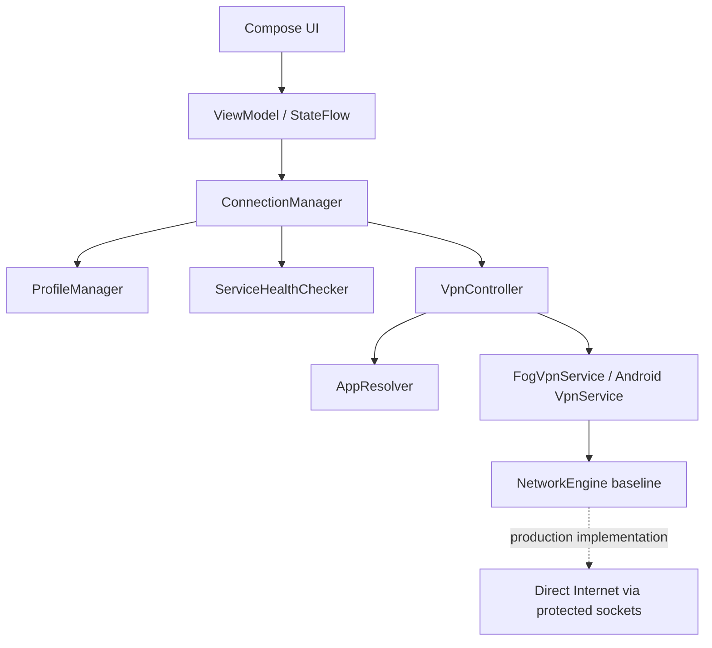
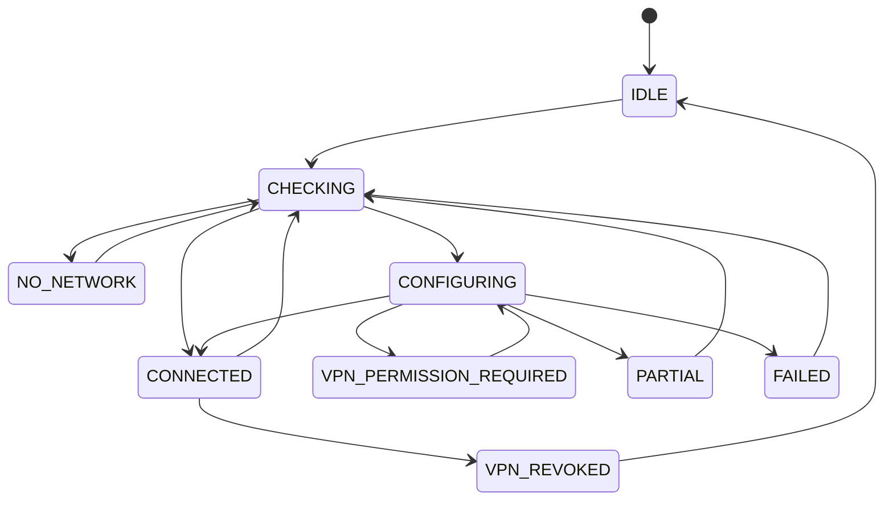

# FOG Mobile architecture notes

## FOG Prime analysis

FOG Prime is a local Windows utility split into UI, Agent, and Engine. The UI is deliberately thin, the Agent owns profile selection, state, health checks, integrity verification, and engine lifecycle, and the Engine is a native network runtime based on the pinned zapret/WinDivert stack. Its UX is a minimal diagnostic flow: system check, connection setup, and final access check.

The visual language is precise and restrained: Inter/system typography, a monospace FOG wordmark, sharp grid borders, mostly black/white surfaces, `#f50db4` as the bright accent, clear stage cards, no fake progress semantics, and terse status copy.

## Conceptual reuse

- UI -> Agent -> Engine responsibility split.
- Small audited profile catalog with AUTO as the default.
- Local-only privacy model with no telemetry, no account, and no hosted backend.
- Health checks before success states are shown.
- Diagnostic details separated from the dashboard.
- Runtime lifecycle owned by the app process and service state.

## Windows-only parts not ported

- WinDivert packet interception.
- Windows elevation, Base Filtering Engine checks, named pipes, and portable process ownership.
- Direct launch of `FOG.Engine.exe` with Windows command arguments.
- Windows-specific zapret runtime packaging and PowerShell build flow.

## Android architecture

## Module structure

This first iteration uses one Android Gradle module with clean package boundaries:

- `core`: app state and shared models.
- `domain`: manager interfaces and policy logic.
- `data`: DataStore-backed preferences and health checks.
- `network`: connectivity observation.
- `vpn`: VpnService, AppResolver, controller, NetworkEngine boundary.
- `ui`: Compose screens, navigation, previews, theme.
- `diagnostics`: anonymized diagnostic export.

## State machine

## Baseline engine boundary

The APK implements a real Android `VpnService` boundary and resolves a per-app allowlist for official Instagram and YouTube packages. The current `BaselineLocalNetworkEngine` declares `canForwardPackets = false`; the service refuses to establish TUN and reports failure instead of blackholing app traffic. The forwarding engine remains behind the `NetworkEngine` interface so a production TCP/UDP flow manager can be added without coupling UI to packet handling.
